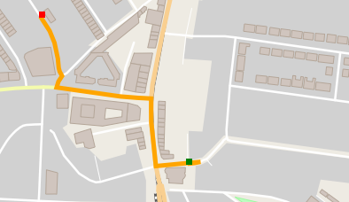
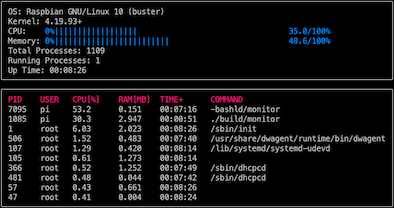
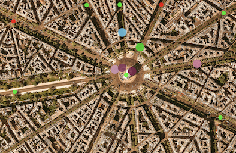
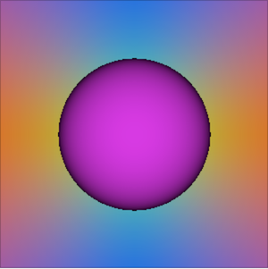

# C++ NanoDegree

### Foundations

- C++ syntax, variables, functions, and containers
- A* algorithm on ASCII grid
- Build tools, header files, pointers and references

**Project**: [OpenStreetMap Route Planner](route-planning)

### Object-Oriented Programming

- Structures and classes
- Encapsulation and abstraction
- Inheritance and polymorphism
- Overriding, overloading, and virtual functions

**Project**: [Linux System Monitor](system-monitor)

### Memory Management

- Memory addresses, hex, and memory types
- Using a debugger
- The stack and the heap
- Call-by-value and call-by-reference
- malloc and free, new and delete
- Copy semantics, lvalues and rvalues, and move semantics
- Resource Acquisition Is Initialisation (RAII)
- Smart pointers

**Project**: [Memory Management Chatbot](membot)

### Concurrency

- Threads and tasks
- Variadic templates
- Fork-join parallelism
- Promises and futures
- Mutex, locks, and message queues

**Project**: [Traffic Simulation](traffic-sim)

### Capstone

**Project** [Ray Tracing Renderer](ray-tracer)

