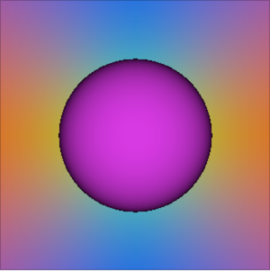

# Capstone project: Ray tracer

Very basic implementation of [ray tracing algorithm](https://en.wikipedia.org/wiki/Ray_tracing_(graphics)).

> In computer graphics, ray tracing is a rendering technique for generating an image by tracing the path of light as pixels in an image plane and simulating the effects of its encounters with virtual objects. The technique is capable of producing a high degree of visual realism, more so than typical scanline rendering methods, but at a greater computational cost. This makes ray tracing best suited for applications where taking a relatively long time to render can be tolerated, such as in still computer-generated images, and film and television visual effects (VFX), but more poorly suited to real-time applications such as video games, where speed is critical in rendering each frame.

## Build and run

```bash
make build
./build/raytracer
```

will produce this `rendering.ppm`



## Rubric points addressed

### README (All Rubric Points REQUIRED)
- A README with instructions is included with the project
- The README indicates which project is chosen.
- The README includes information about each rubric point addressed.

### Compiling and Testing (All Rubric Points REQUIRED)
- The submission must compile and run.

### Loops, Functions, I/O
- The project demonstrates an understanding of C++ functions and control structures: _All the vector calculations are handled with a `for` loop (e.g. `src/sphere.cpp:13-15`)_. 
- The project reads data from a file and process the data, or the program writes data to a file: _The final rendering is written to file by `Camera::render` method_.
- 

### Object Oriented Programming
- The project uses Object Oriented Programming techniques: the project code is organized into classes with class attributes to hold the data, and class methods to perform tasks _(e.g. the `Sphere` class)_.
- Classes use appropriate access specifiers for class members: all class data members are explicitly specified as public, protected, or private _(e.g. the `Ray` class)_.
- Class constructors utilize member initialization lists _(e.g. `src/camera.cpp:9-13`)_.
- Classes abstract implementation details from their interfaces _(e.g. the `Solid` class)_.
- Classes encapsulate behavior _(e.g. the `Sphere` class)_.
- Classes follow an appropriate inheritance hierarch y  _(e.g. the `Sphere` and `Solid` classes)_.

### Memory Management
- The project makes use of references in function declarations _(e.g. `Sphere::hitBy` and `Sphere::normalAt` methods in `src/sphere.cpp`)_.

## Features
- Camera model
- Sphere as a solid

## To do
- 3D vector class
- Configuration file
- Diffusion, reflection, and refraction
- Lens model
- GPU/multi-threaded rendering
- Triangles and meshes

## Resources

- [Introduction to Ray Tracing: a Simple Method for Creating 3D Images](https://www.scratchapixel.com/lessons/3d-basic-rendering/introduction-to-ray-tracing)
- [Ray Tracing in One Weekend](http://viclw17.github.io/tag/#/Ray%20Tracing%20in%20One%20Weekend)